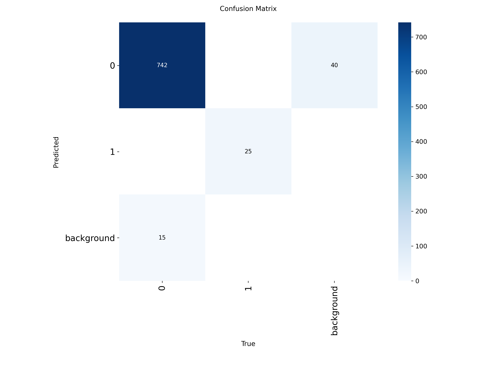
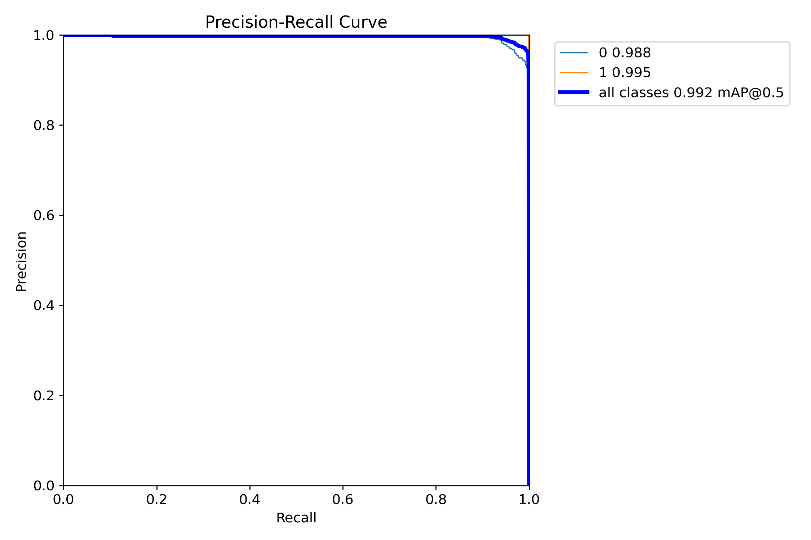
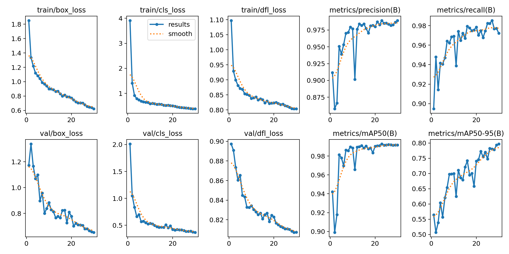
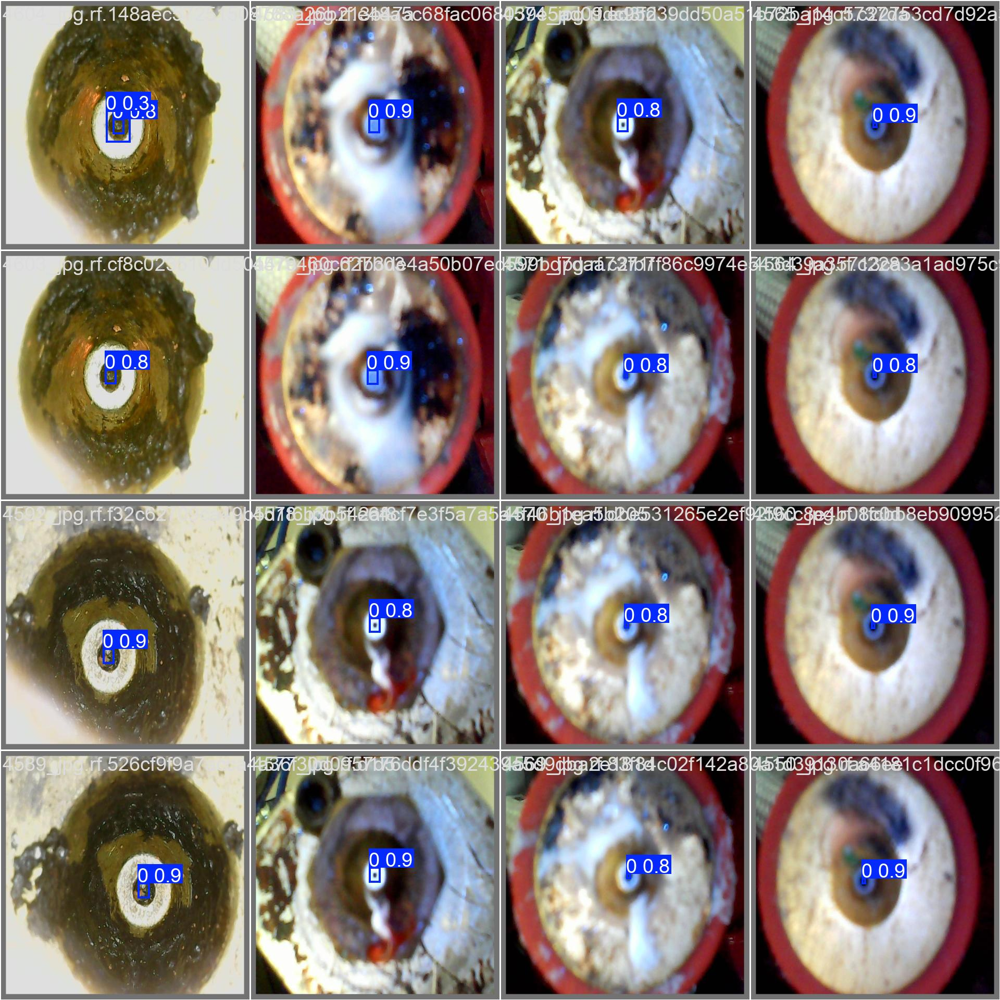

# kTAY8 - klipper Tool Alignment using YOLOv8n

**kTAY8** is an advanced tool alignment system for Klipper firmware, leveraging **Deep Learning** and **Computer Vision** to automatically detect and center the 3D printer nozzle relative to a fixed upward-facing camera.

Unlike traditional systems based **kTAY8 employs a YOLOv8 Convolutional Neural Network (CNN)** specifically trained to perform robust object detection in challenging environments.

<p align="center">
  
</p>

---

## 🙏 Acknowledgments & Credits

This project is an **evolutionary fork** of [kTAMV (Klipper Tool Alignment Machine Vision)](https://github.com/TypQxQ/kTAMV).
Special thanks to:
*   **TypQxQ**: The original author of kTAMV, who architected the server infrastructure and Klipper integration that serves as the backbone for this project.
*   **kTAMV Contributors and TypQxQ**: For the initial dataset that bootstrapped the training process.

---

## 🧠 The AI Core: YOLOv8 Inference

The core of kTAY8 is a **YOLOv8n (Nano)** model, optimized and exported to **ONNX/TFLite** for edge inference on ARM-based SBCs (Single Board Computers) like Raspberry Pi.

### Why AI?
Standard CV algorithms (e.g., OpenCV SimpleBlobDetector) fail when:
*   **Occlusion/Noise:** The nozzle is covered in filament debris.
*   **Lighting Variance:** Specular reflections on the build plate or nozzle surface.
*   **Background Complexity:** Non-uniform backgrounds confuse thresholding algorithms.

**kTAY8's Neural Network** abstracts these features, learning the semantic representation of a "nozzle" "regardless of surface conditions".

> **⚠️ Model Status: Experimental Alpha (v1)**
> The current model (server/best.onnx) is an initial release and is not fully tested. The project is currently in a basic state, and further development is temporarily delayed due to external factors (hardware issues with my custom 3D printer and personal work commitments).
Note on Contributions: The Telegram bot for submitting nozzle images is not active yet because the model itself is not ready. Please wait for the completion of the Alpha phase and the merge from dev to main before attempting to contribute. The project structure is currently too fragmented for external input.

---

## 📊 Model Performance & Validation

The following metrics demonstrate the model's performance on the validation dataset (unseen data).

### 1. Detection Accuracy (Confusion Matrix)
<p align="center">
  
</p>

The **Confusion Matrix** illustrates the classification accuracy.
*   **Diagonal Elements:** Represent correct predictions. A high value (close to 1.0) for the "nozzle" class indicates the model correctly identifies the nozzle when it is present.
*   **Off-diagonal Elements:** Represent errors (False Positives/Negatives). Low values here confirm the model rarely confuses the background with the nozzle.

### 2. Precision-Recall Curve
<p align="center">
  
</p>

The **PR Curve** shows the trade-off between Precision and Recall at different confidence thresholds.
*   **Precision:** "Of all the objects detected as nozzles, how many were actually nozzles?" (High precision = few false alarms).
*   **Recall:** "Of all the actual nozzles in the image, how many did we detect?" (High recall = few missed detections).
*   **mAP@0.5:** The area under this curve represents the overall robustness of the model.

### 3. Training Convergence (Results)
<p align="center">
  
</p>

*   **Box Loss:** Measures how accurately the model draws the bounding box around the nozzle. Decreasing loss indicates improved localization.
*   **Cls Loss (Classification):** Measures the confidence in identifying the object as a "nozzle".
*   **mAP50 / mAP50-95:** Mean Average Precision metrics. Rising curves indicate the model is learning effectively over the training epochs.

### 4. Visual Validation
<p align="center">
  
</p>

A sample batch from the validation set showing the model's predictions (bounding boxes) overlaid on ground truth data. This confirms the model can handle various orientations and lighting conditions.

---

## 🤝 Contributing to the Model

> ⛔ Please Ignore This Section (Temporary)
This section should be disregarded until a more stable version of the project is released. Contribution channels are currently closed while the core infrastructure is being finalized.

**We do not recommend retraining the model locally.** To ensure a robust, generalized model that works for everyone, we centralize the training process.

### How to Contribute Data
If the detection is inaccurate on your machine, **do not retrain**. Instead, contribute to the global dataset:

1.  Enable the `send_frame_to_cloud` option in your configuration (or manually capture frames).
2.  Send the raw images of your nozzle (from the nozzle camera) to our **Data Collection Bot** on Telegram.
3.  These images will be labeled and integrated into the next training epoch, improving the model for the entire community.

*Telegram Bot Link: [Contact Maintainer for Access]*

---

## 🛠️ Installation & Deployment

> ⛔ Please Ignore This Section (Temporary)
This section should be disregarded until a more stable version of the project is released. Contribution channels are currently closed while the core infrastructure is being finalized.

### System Architecture
kTAY8 operates as a standalone Python service that communicates with Klipper via HTTP APIs. It requires an SBC capable of running ONNX Runtime or TensorFlow Lite.

### Automated Setup
1.  Clone the repository to your user home directory (e.g., `/home/pi`):
    ```bash
    cd ~
    git clone https://github.com/YourUsername/kTAY8.git
    ```
2.  Execute the deployment script:
    ```bash
    cd kTAY8
    ./install.sh
    ```
    *This script handles dependency resolution (numpy, opencv-python, onnxruntime), systemd service registration, and `printer.cfg` injection.*

3.  **Restart Klipper and Moonraker** to apply changes.

---

## ⚙️ Configuration Parameters

> ⛔ Please Ignore This Section (Temporary)
This section should be disregarded until a more stable version of the project is released. Contribution channels are currently closed while the core infrastructure is being finalized.

Ensure your `printer.cfg` contains the `[ktay8]` section. Adjust the `nozzle_cam_url` to match your MJPEG stream source.

```ini
[ktay8]
# MJPEG Stream URL (Localhost loopback recommended for low latency)
nozzle_cam_url: http://localhost/webcam/snapshot?max_delay=0

# kTAY8 Server Endpoint
server_url: http://localhost:8085

# Alignment Feedrate (mm/min)
move_speed: 1800

# Telemetry: Send frames for dataset improvement (Set to True to contribute)
send_frame_to_cloud: false

# Convergence Tolerance (Pixels) - 0 implies sub-pixel precision attempts
detection_tolerance: 0
```

<p align="center">
  
  
</p>

---

## 🎮 Operational Workflow

> ⛔ Please Ignore This Section (Temporary)
This section should be disregarded until a more stable version of the project is released. Contribution channels are currently closed while the core infrastructure is being finalized.

kTAY8 exposes G-Code macros for integration into print start scripts or toolchange macros.

### 1. Camera Extrinsics Calibration
Before inference, the system must map the camera's coordinate system to the printer's kinematic system (Cartesian/CoreXY).

*   **Macro:** `CALIB_CAMERA_KTAY8`
*   **Action:** Performs a star-pattern movement to calculate rotation angle and pixel-to-mm scale factor.

### 2. Inference & Alignment
Executes the inference pipeline to detect the nozzle centroid and iteratively moves the toolhead to align it with the camera's optical center.

*   **Macro:** `FIND_NOZZLE_CENTER_KTAY8`
*   **Logic:**
    1.  Acquire Frame -> Preprocess (Resize/Normalize)
    2.  YOLOv8 Inference -> Bounding Box & Confidence Score
    3.  Calculate Error Vector (Delta X, Delta Y)
    4.  Move Toolhead -> Repeat until Error < Tolerance

### 3. Origin Definition
Sets the aligned position as the reference origin for tool offsets.

*   **Macro:** `SET_ORIGIN_KTAY8`

---

## ⚠️ Troubleshooting & Diagnostics

> ⛔ Please Ignore This Section (Temporary)
This section should be disregarded until a more stable version of the project is released. Contribution channels are currently closed while the core infrastructure is being finalized.

*   **Service Status:** Check the systemd service logs:
    ```bash
    journalctl -u kTAY8_server.service -f
    ```
*   **Inference Latency:** If detection is slow, ensure you are using the **ONNX** model and that `onnxruntime` is utilizing available instruction sets (NEON/SSE).
*   **"Nozzle Not Found":**
    *   Verify `nozzle_cam_url` accessibility.
    *   Ensure the nozzle is within the Field of View (FOV).
    *   Check illumination levels.

---

**Disclaimer:** This software commands physical motion of CNC hardware. Always supervise operation during calibration sequences. The authors assume no liability for hardware or software damage.
